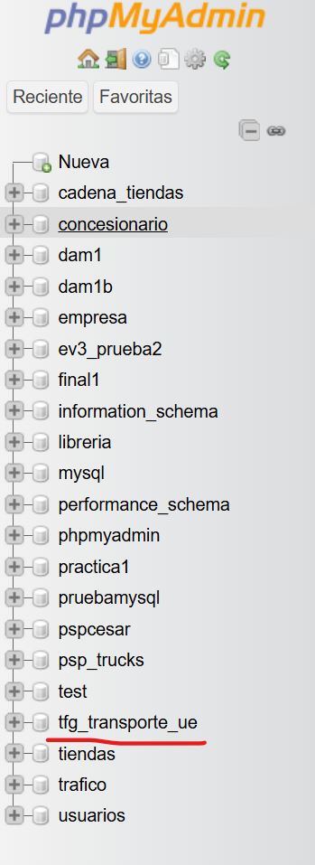
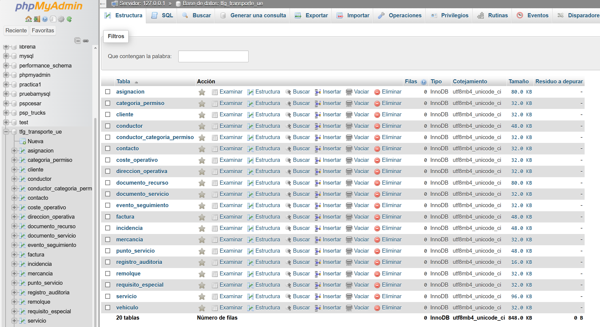
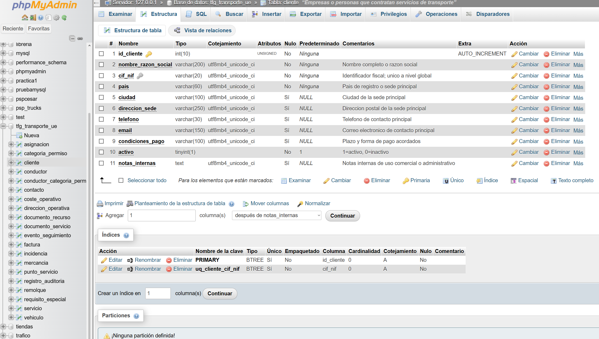
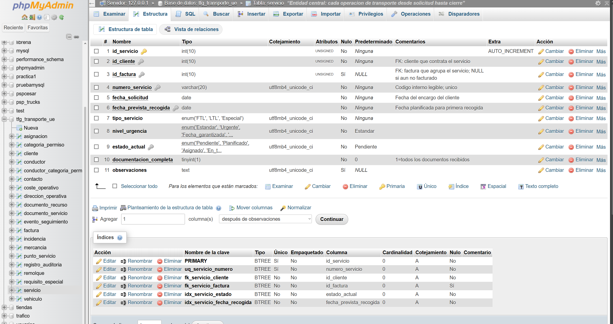
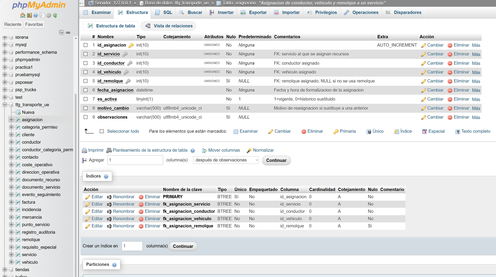
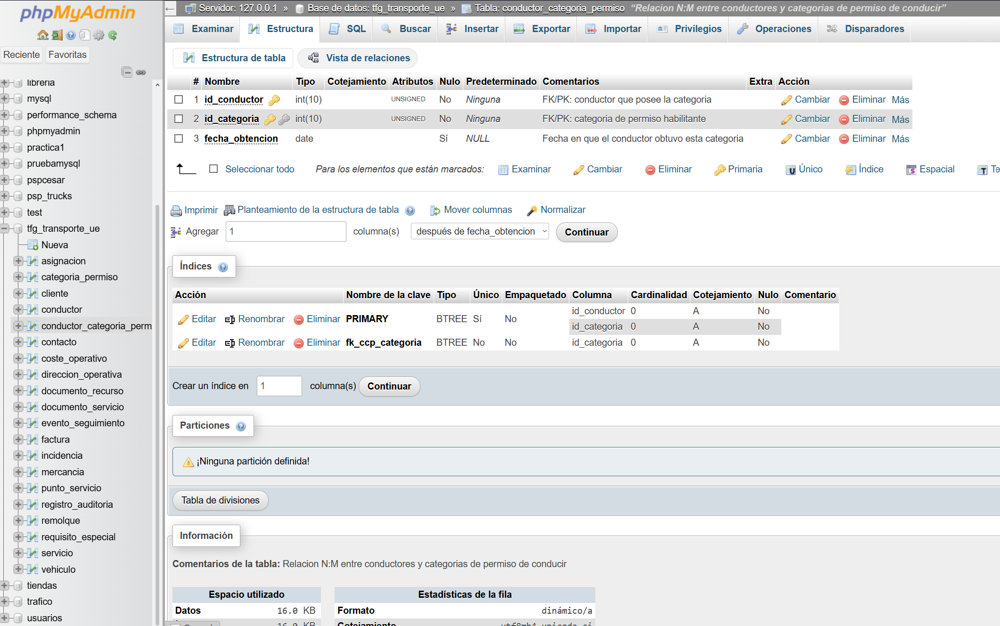
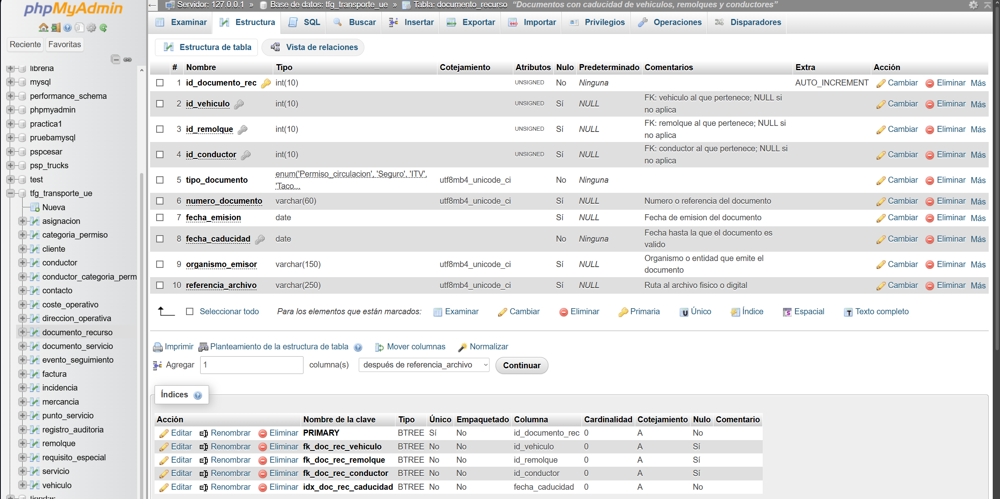
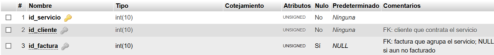
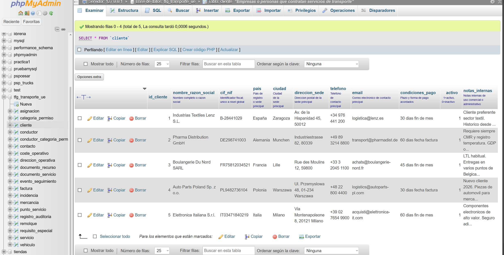
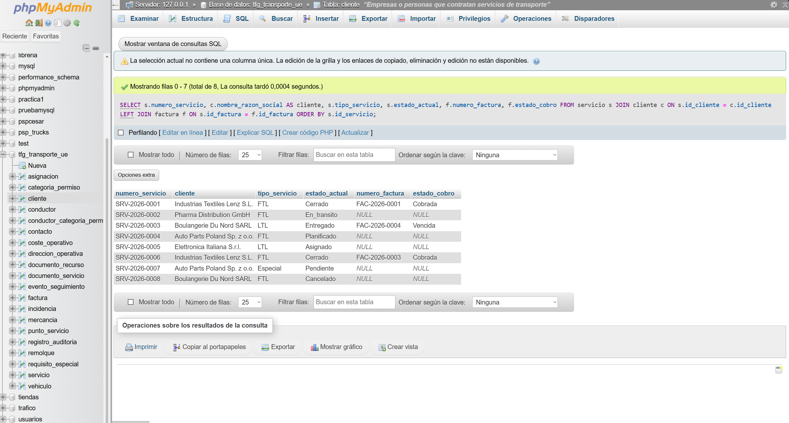

# Capturas phpMyAdmin - FASE 4

**Proyecto:** Diseno, creacion y explotacion de una base de datos para la gestion integral
de una empresa de transporte intracomunitario por carretera (UE)
**Fase:** 4 - Diseno Fisico en MySQL
**Modulo:** Proyecto 2 DAM - Centro FP Maria Auxiliadora - Curso 2024-26
**Alumno:** Cesar Mendez

---

## Estado de pruebas ejecutadas

| Script | Estado | Resultado |
|---|---|---|
| schema.sql | Ejecutado | Sin errores. 20 tablas creadas en tfg_transporte_ue. |
| alter_table.sql | Ejecutado | Sin errores. km_estimados anadido; indice idx_factura_cobro creado. |
| datos_prueba.sql | Ejecutado | Sin errores. Datos cargados y verificados con consultas de comprobacion. |

**Verificaciones realizadas:**
- 20 tablas visibles en phpMyAdmin
- Datos presentes en todas las tablas
- Consulta servicios/cliente/factura: 8 filas correctas (SRV-0001 a SRV-0008)
- Consulta conductor_categoria_permiso: registros coherentes
- Consulta asignaciones: historico de reasignacion visible
- documento_recurso: 35 registros cargados

---

## Orden de ejecucion previo a las capturas

```
1. Abrir phpMyAdmin en http://localhost/phpmyadmin
2. Ir a "SQL" y ejecutar el contenido de: schema.sql
3. Verificar que aparece la base de datos tfg_transporte_ue con 20 tablas
4. Ejecutar el contenido de: alter_table.sql
5. Verificar que servicio tiene la columna km_estimados
6. Ejecutar el contenido de: datos_prueba.sql
7. Verificar que cada tabla tiene datos
8. Obtener las capturas de este documento en el orden indicado
```

---

## Captura 1 - Base de datos creada

**Que mostrar:** Panel izquierdo de phpMyAdmin con `tfg_transporte_ue` visible en el
listado de bases de datos. Hacer clic en la base de datos para expandirla.

**Ruta phpMyAdmin:** Inicio > Panel lateral izquierdo > tfg_transporte_ue



---

## Captura 2 - Lista de las 20 tablas

**Que mostrar:** Vista de la base de datos `tfg_transporte_ue` con las 20 tablas listadas
en el panel lateral o en la vista principal. Deben verse todas:
asignacion, categoria_permiso, cliente, coste_operativo, conductor,
conductor_categoria_permiso, direccion_operativa, documento_recurso,
documento_servicio, evento_seguimiento, factura, incidencia, mercancia,
punto_servicio, registro_auditoria, remolque, requisito_especial,
servicio, vehiculo.

**Ruta phpMyAdmin:** tfg_transporte_ue > (lista de tablas)



---

## Captura 3 - Estructura de la tabla cliente

**Que mostrar:** Pestana "Estructura" de la tabla `cliente` con todas las columnas,
tipos de dato, restricciones NOT NULL, DEFAULT y la clave UNIQUE sobre cif_nif.

**Ruta phpMyAdmin:** tfg_transporte_ue > cliente > Estructura



---

## Captura 4 - Estructura de la tabla servicio

**Que mostrar:** Pestana "Estructura" de la tabla `servicio` con sus 12 columnas
(incluyendo km_estimados anadida por ALTER TABLE), los tipos ENUM, la PK y las FKs
a cliente y factura.

**Ruta phpMyAdmin:** tfg_transporte_ue > servicio > Estructura



---

## Captura 5 - Estructura de la tabla asignacion

**Que mostrar:** Pestana "Estructura" de `asignacion` con sus columnas. Es importante
ver que id_remolque permite NULL (FK opcional al remolque) y que es_activa tiene DEFAULT 1.

**Ruta phpMyAdmin:** tfg_transporte_ue > asignacion > Estructura



---

## Captura 6 - Estructura de la tabla conductor_categoria_permiso

**Que mostrar:** Pestana "Estructura" de `conductor_categoria_permiso` con la PK compuesta
(id_conductor, id_categoria) y las dos FK a conductor y categoria_permiso.

**Ruta phpMyAdmin:** tfg_transporte_ue > conductor_categoria_permiso > Estructura



---

## Captura 7 - Estructura de la tabla documento_recurso

**Que mostrar:** Pestana "Estructura" de `documento_recurso` con las tres FK opcionales
(id_vehiculo, id_remolque, id_conductor) todas con NULL permitido, y la restriccion CHECK
visible en la seccion de restricciones o en el panel de indices.

**Ruta phpMyAdmin:** tfg_transporte_ue > documento_recurso > Estructura



---

## Captura 8 - Relaciones y claves foraneas (Designer o vista FK)

**Que mostrar:** Vista "Designer" de phpMyAdmin (si esta disponible) con el diagrama de
relaciones entre tablas, o bien la seccion "Claves foraneas" de alguna tabla central como
`servicio` o `asignacion` donde se ven las FK definidas con ON DELETE y ON UPDATE.

**Ruta phpMyAdmin:** tfg_transporte_ue > Designer
o: tfg_transporte_ue > servicio > Estructura > seccion Restricciones



---

## Captura 9 - Datos cargados (tabla servicio o cliente)

**Que mostrar:** Pestana "Examinar" de la tabla `servicio` o `cliente` con los registros
insertados por datos_prueba.sql visibles en la vista de tabla.

**Ruta phpMyAdmin:** tfg_transporte_ue > servicio > Examinar



---

## Captura 10 - Resultado de una consulta de comprobacion

**Que mostrar:** Resultado de ejecutar en la pestana SQL de phpMyAdmin una consulta de
verificacion. Sugerencia:

```sql
-- Comprobar servicios con su cliente, estado y factura
SELECT
    s.numero_servicio,
    c.nombre_razon_social AS cliente,
    s.tipo_servicio,
    s.estado_actual,
    f.numero_factura,
    f.estado_cobro
FROM servicio s
JOIN cliente c ON s.id_cliente = c.id_cliente
LEFT JOIN factura f ON s.id_factura = f.id_factura
ORDER BY s.id_servicio;
```

**Resultado esperado:** 8 filas (SRV-0001 a SRV-0008) con datos coherentes.

**Ruta phpMyAdmin:** tfg_transporte_ue > SQL > ejecutar consulta



