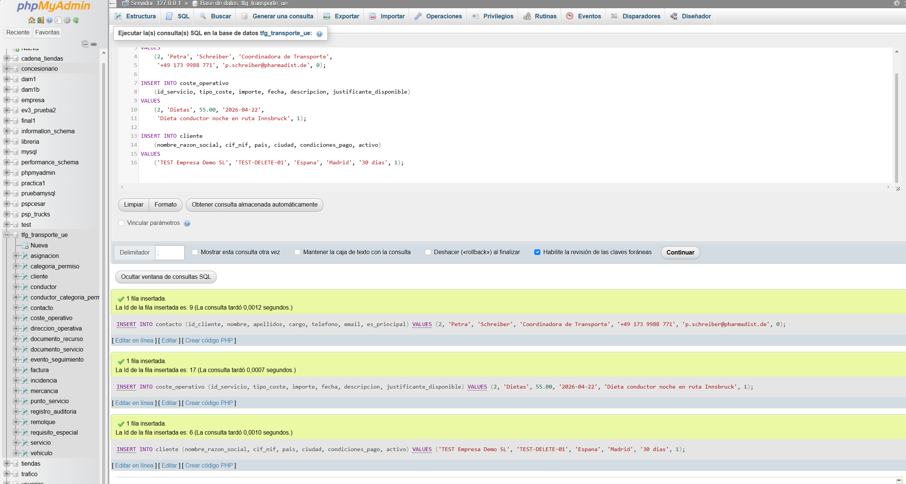
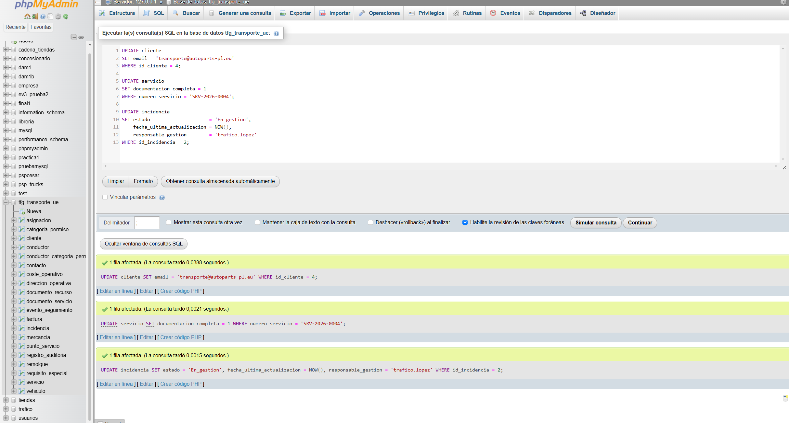
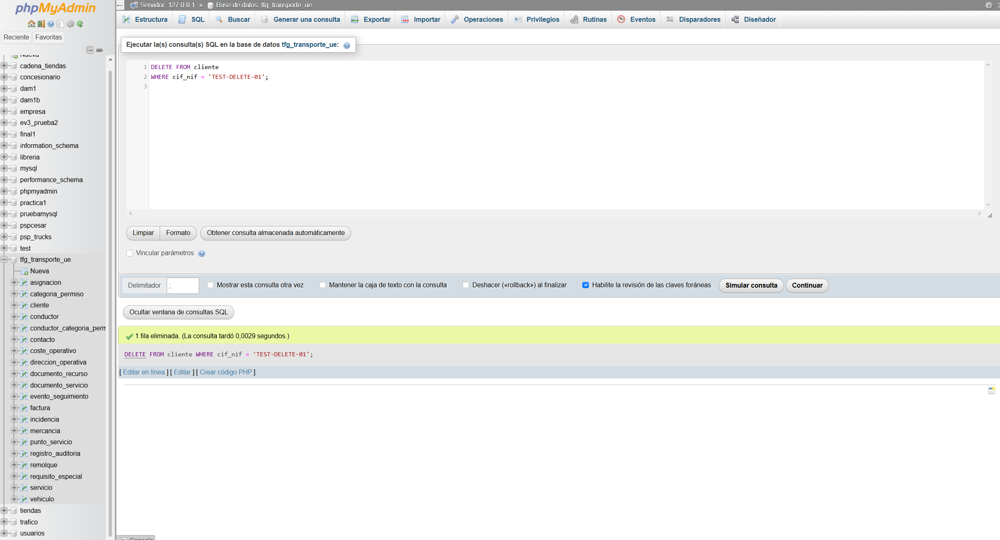
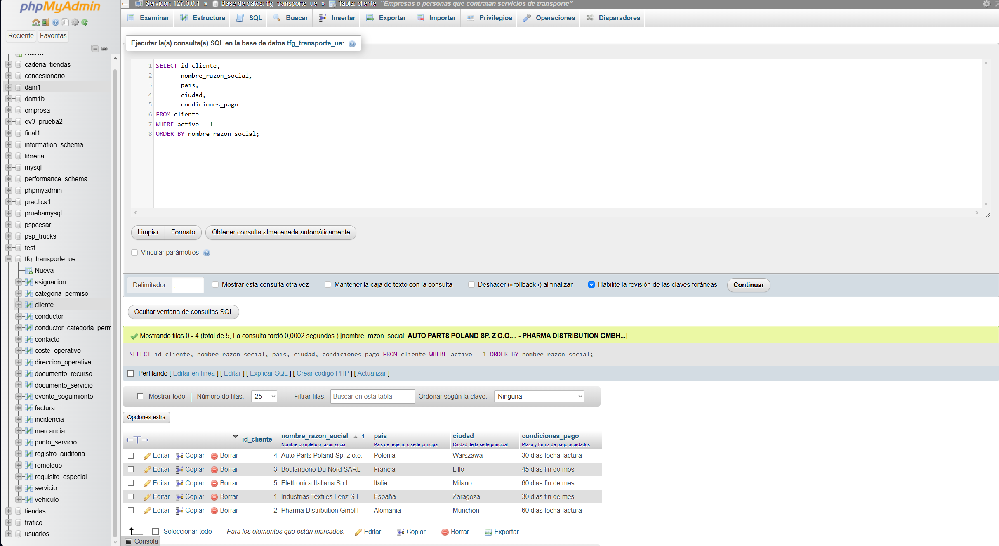
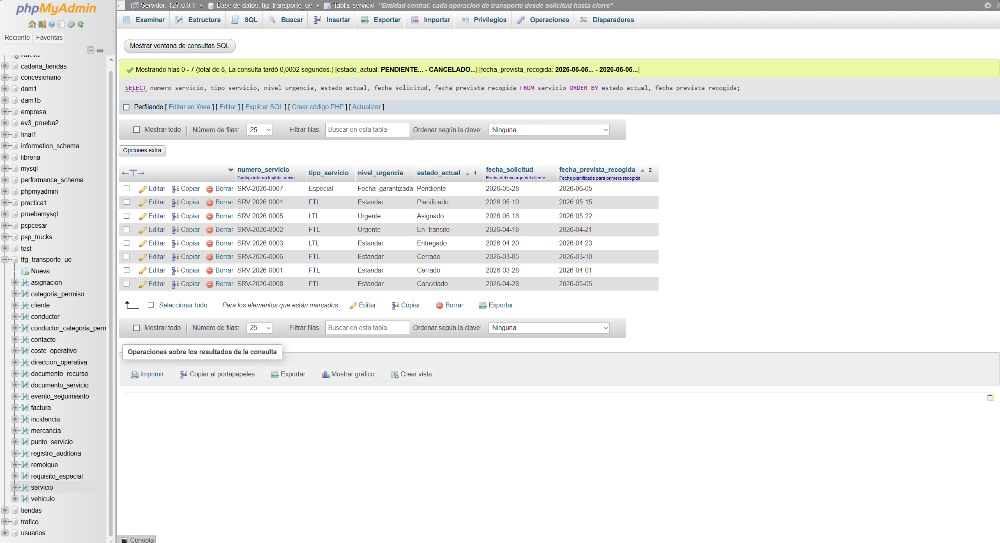
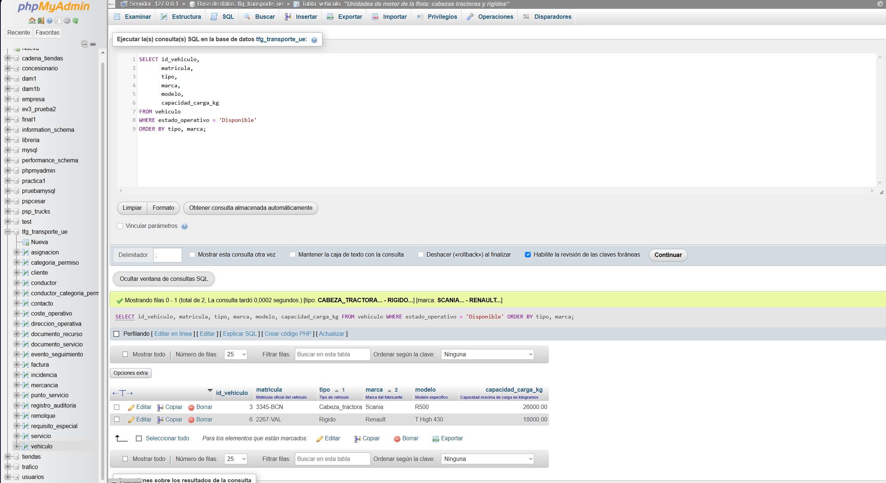
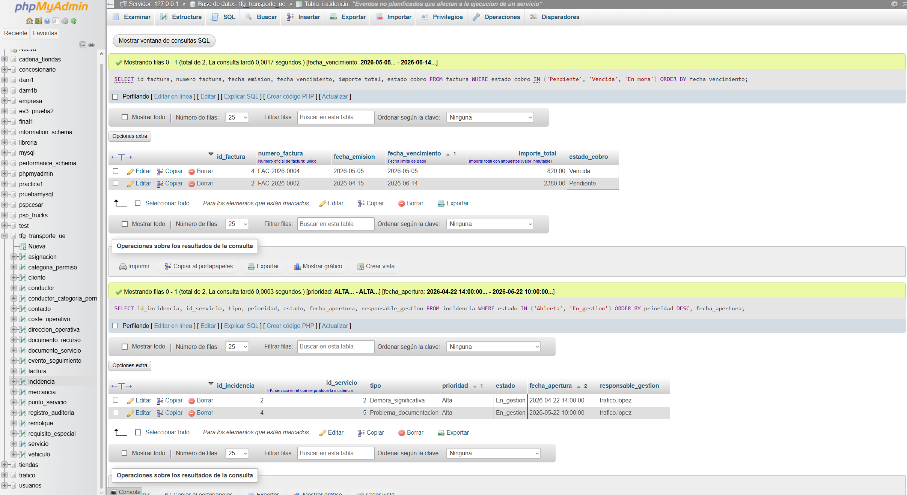

# Capturas de Resultados -- FASE 5

**Proyecto:** TFG - Base de Datos Empresa de Transporte Intracomunitario (UE)
**Herramienta:** phpMyAdmin sobre MySQL 8.x
**Base de datos:** tfg_transporte_ue

Las capturas se obtienen ejecutando cada seccion del script `consultas_basicas.sql`
por separado en la pestana SQL de phpMyAdmin.

---

## cap01 -- INSERT: Añadir nuevos registros (Actividad 1)



> **Pendiente de captura.**
> Ejecutar la seccion ACTIVIDAD 1 del script. Capturar el mensaje de confirmacion
> ("3 rows affected" o similar) y opcionalmente el SELECT de verificacion.

**Que debe mostrar:**
- Confirmacion de 3 filas insertadas (contacto + coste_operativo + cliente de prueba)
- O capturas separadas de cada INSERT si se prefiere mostrarlas individualmente

---

## cap02 -- UPDATE: Modificar datos existentes (Actividad 2)



> **Pendiente de captura.**
> Ejecutar la seccion ACTIVIDAD 2 del script. Capturar el mensaje de confirmacion
> y el resultado del campo modificado (email, documentacion_completa, estado incidencia).

**Que debe mostrar:**
- Resultado del UPDATE sobre cliente id=4 (email actualizado)
- Resultado del UPDATE sobre SRV-2026-0004 (documentacion_completa=1)
- Resultado del UPDATE sobre incidencia id=2 (estado='En_gestion')

---

## cap03 -- DELETE: Borrar registro de prueba (Actividad 3)



> **Pendiente de captura.**
> Ejecutar la seccion ACTIVIDAD 3 del script. Capturar el mensaje de confirmacion
> ("1 row affected") que confirma la eliminacion del cliente TEST-DELETE-01.

**Que debe mostrar:**
- Confirmacion de 1 fila eliminada para el cliente con CIF='TEST-DELETE-01'

---

## cap04 -- SELECT: Clientes activos (Actividad 4)



> **Pendiente de captura.**
> Ejecutar la seccion ACTIVIDAD 4 del script. Capturar la tabla de resultados completa.

**Que debe mostrar:**
- 5 filas: Auto Parts Poland, Boulangerie Du Nord, Elettronica Italiana, Industrias Textiles Lenz, Pharma Distribution
- Columnas: id_cliente, nombre_razon_social, pais, ciudad, condiciones_pago
- Ordenados alfabeticamente por nombre_razon_social

---

## cap05 -- SELECT: Servicios por estado (Actividad 5)



> **Pendiente de captura.**
> Ejecutar la seccion ACTIVIDAD 5 del script. Capturar la tabla de resultados completa.

**Que debe mostrar:**
- 8 filas con todos los servicios
- Columnas: numero_servicio, tipo_servicio, nivel_urgencia, estado_actual, fecha_solicitud, fecha_prevista_recogida
- Ordenados por estado_actual y luego por fecha

---

## cap06 -- SELECT: Vehiculos y conductores disponibles (Actividad 6)



> **Pendiente de captura.**
> Ejecutar las dos consultas de la seccion ACTIVIDAD 6. Capturar ambas tablas de resultados.

**Que debe mostrar:**
- Vehiculos disponibles: Scania R500 (3345-BCN) y Renault T High 430 (2267-VAL) -- 2 filas
- Conductores disponibles: Jan Kowalski (EMP-0055) y Pedro Ramos (EMP-0033) -- 2 filas

---

## cap07 -- SELECT: Facturas pendientes e incidencias abiertas (Actividad 7)



> **Pendiente de captura.**
> Ejecutar las dos consultas de la seccion ACTIVIDAD 7. Capturar ambas tablas de resultados.

**Que debe mostrar:**
- Facturas pendientes/vencidas: FAC-2026-0002 (Pendiente, 2.380 EUR) y FAC-2026-0004 (Vencida, 820 EUR) -- 2 filas
- Incidencias activas: id=2 (Pharma, Alta, En_gestion) e id=4 (Electronica, Alta, En_gestion) -- 2 filas

---

## Rutas de archivos de captura

Guardar las capturas en:

```
05_FASE_5_Explotacion_Basica_SQL/borradores/
  cap01_insert.png
  cap02_update.png
  cap03_delete.png
  cap04_clientes_activos.png
  cap05_servicios_estado.png
  cap06_recursos_disponibles.png
  cap07_facturas_incidencias.png
```

Una vez añadidas las capturas reales, actualizar las rutas de imagen en este documento
y marcar la Actividad 8 del README como completada.
