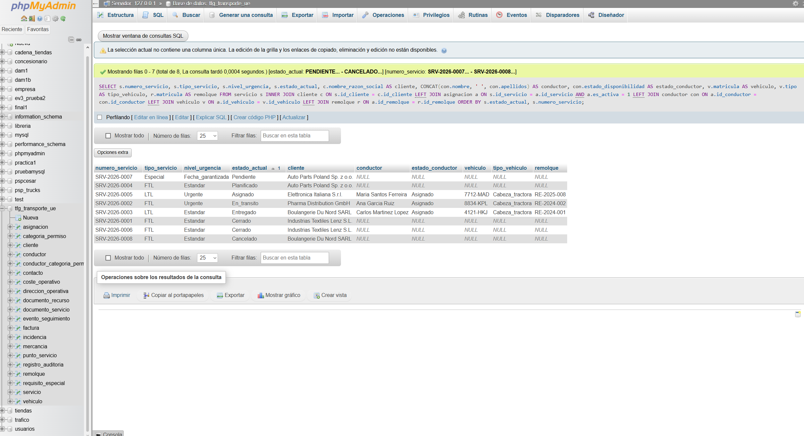
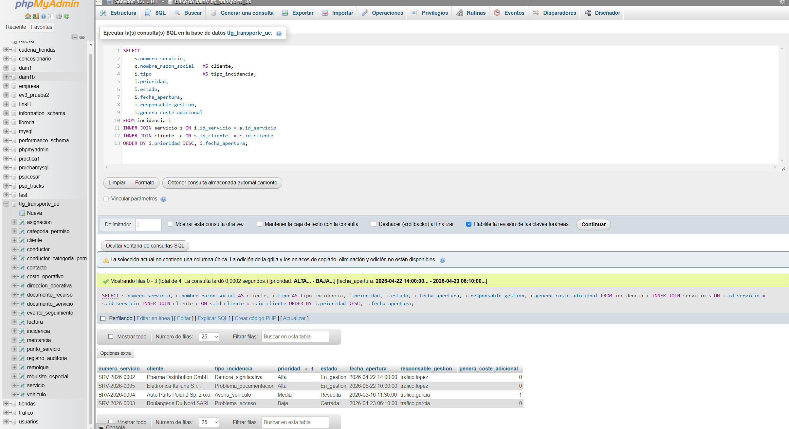
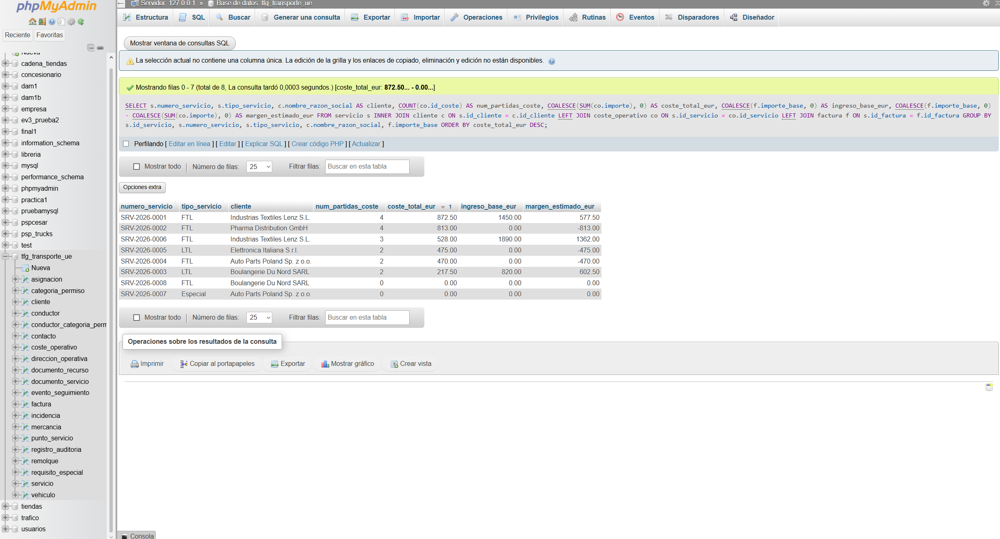
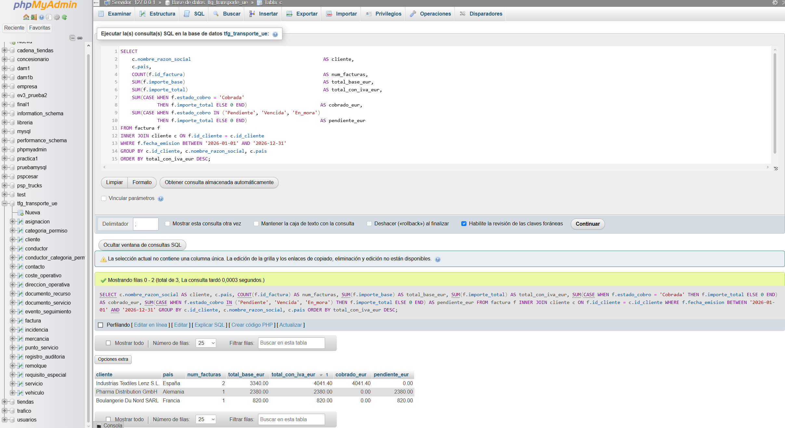
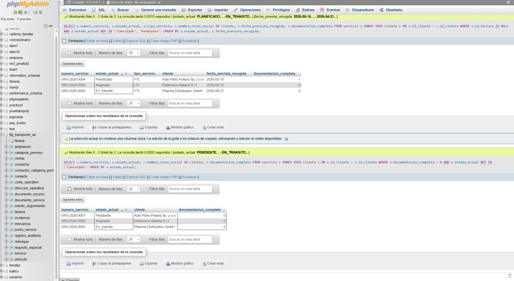
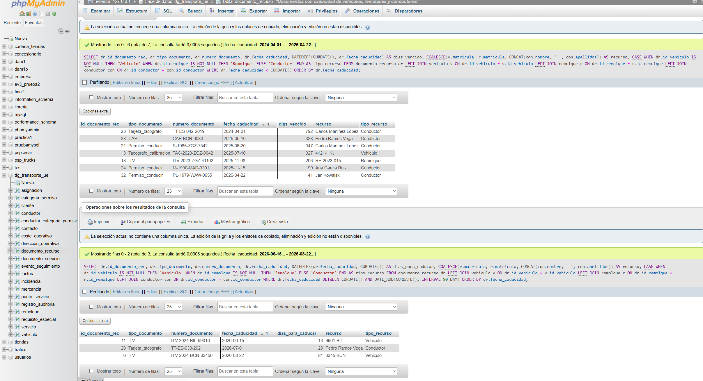
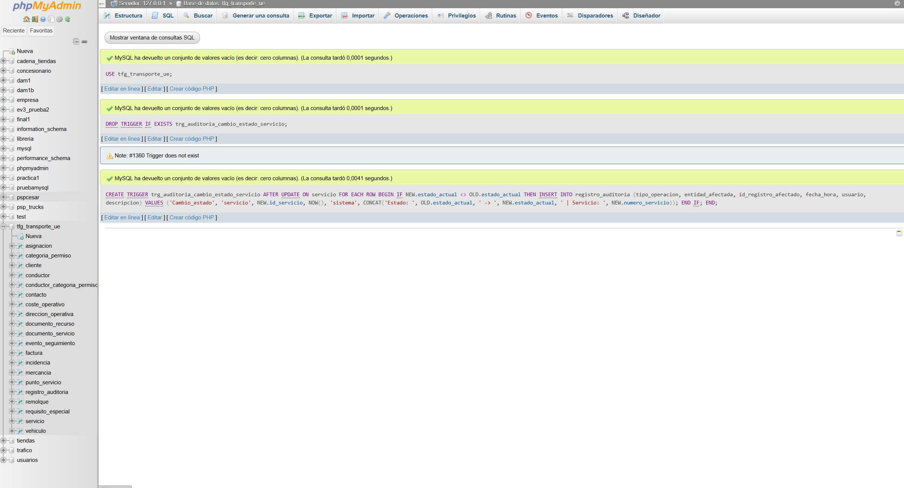
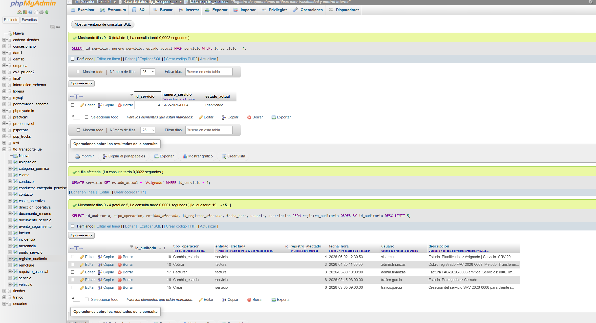

# Capturas de Resultados -- FASE 6

**Proyecto:** TFG - Base de Datos Empresa de Transporte Intracomunitario (UE)
**Herramienta:** phpMyAdmin sobre MySQL 8.x
**Base de datos:** tfg_transporte_ue

Las capturas se obtienen ejecutando cada seccion de `consultas_avanzadas.sql`
y `trigger_auditoria.sql` por separado en la pestana SQL de phpMyAdmin.

---

## cap01 -- Servicios con cliente, conductor y vehiculo (Actividades 1 + 2)



> **Pendiente de captura.**
> Ejecutar la primera consulta de consultas_avanzadas.sql (seccion ACTIVIDADES 1+2).

**Que debe mostrar:**
- 8 filas (una por servicio)
- Columnas: numero_servicio, tipo_servicio, nivel_urgencia, estado_actual, cliente, conductor, estado_conductor, vehiculo, tipo_vehiculo, remolque
- Servicios sin asignacion activa (Pendiente, Planificado) muestran NULL en conductor y vehiculo

---

## cap02 -- Incidencias relacionadas con servicios (Actividad 3)



> **Pendiente de captura.**
> Ejecutar la consulta de la seccion ACTIVIDAD 3.

**Que debe mostrar:**
- 4 filas con las incidencias registradas
- Columnas: numero_servicio, cliente, tipo_incidencia, prioridad, estado, fecha_apertura, responsable_gestion, genera_coste_adicional
- Las incidencias de prioridad Alta aparecen primero

---

## cap03 -- Costes totales y margen por servicio (Actividad 4)



> **Pendiente de captura.**
> Ejecutar la consulta de la seccion ACTIVIDAD 4.

**Que debe mostrar:**
- 8 filas (una por servicio), ordenadas de mayor a menor coste
- Columnas: numero_servicio, tipo_servicio, cliente, num_partidas_coste, coste_total_eur, ingreso_base_eur, margen_estimado_eur
- SRV-0001 y SRV-0006 tienen facturas cobradas y margen positivo visible

---

## cap04 -- Facturacion por cliente y periodo (Actividad 5)



> **Pendiente de captura.**
> Ejecutar la consulta de la seccion ACTIVIDAD 5.

**Que debe mostrar:**
- 3 filas (Industrias Textiles Lenz, Pharma Distribution, Boulangerie Du Nord)
- Columnas: cliente, pais, num_facturas, total_base_eur, total_con_iva_eur, cobrado_eur, pendiente_eur
- Lenz tiene 4.041,40 EUR cobrados; Pharma 2.380 EUR pendientes; Boulangerie 820 EUR vencidos

---

## cap05 -- Servicios sin facturar y con documentacion incompleta (Actividad 6)



> **Pendiente de captura.**
> Ejecutar las consultas de las secciones ACTIVIDAD 6a y ACTIVIDAD 6b.

**Que debe mostrar:**
- 6a: servicios activos sin id_factura (SRV-0002, SRV-0004, SRV-0005, SRV-0007)
- 6b: servicios con documentacion_completa=0 (varios de los anteriores mas SRV-0007 y SRV-0008)

---

## cap06 -- Documentos caducados y proximos a caducar (Actividad 7)



> **Pendiente de captura.**
> Ejecutar las consultas de las secciones ACTIVIDAD 7a y ACTIVIDAD 7b.

**Que debe mostrar:**
- 7a (caducados): 7+ documentos vencidos incluyendo tacografo Veh1, ITV Rem3, permisos de conducir de Carlos Martinez, Ana Garcia y Jan Kowalski, CAP de Pedro Ramos, tarjeta tacografo de Carlos
- 7b (proximos 90 dias): ITV Veh5 MAN 9901-BIL (caduca 2026-06-15) e ITV Veh3 Scania 3345-BCN (caduca 2026-08-22)

---

## cap07 -- Creacion del trigger (Actividad 8)



> **Pendiente de captura.**
> Ejecutar trigger_auditoria.sql en phpMyAdmin (con delimitador //).
> Capturar la confirmacion de que el trigger se ha creado correctamente.

**Que debe mostrar:**
- Mensaje de confirmacion de MySQL: "Query OK" tras CREATE TRIGGER
- O la lista de triggers de la BD mostrando trg_auditoria_cambio_estado_servicio

---

## cap08 -- Registro generado automaticamente por el trigger (Actividad 8)



> **Pendiente de captura.**
> Ejecutar el Paso 2 y el Paso 3 de la seccion de prueba del trigger.
> Capturar el resultado del SELECT sobre registro_auditoria.

**Que debe mostrar:**
- El registro mas reciente en registro_auditoria con:
  - tipo_operacion = 'Cambio_estado'
  - entidad_afectada = 'servicio'
  - id_registro_afectado = 4
  - descripcion = 'Estado: Planificado -> Asignado | Servicio: SRV-2026-0004'
  - usuario = 'sistema'
  - fecha_hora con la fecha y hora actuales

---

## Rutas de archivos de captura

Guardar las capturas en:

```
06_FASE_6_Explotacion_Avanzada_SQL/borradores/
  cap01_servicios_completos.png
  cap02_incidencias_servicios.png
  cap03_costes_totales.png
  cap04_facturacion_cliente_periodo.png
  cap05_servicios_sin_facturar_doc_incompleta.png
  cap06_documentos_caducados.png
  cap07_trigger_creado.png
  cap08_auditoria_generada.png
```

Una vez añadidas las capturas reales, actualizar las rutas en este documento
y marcar todas las actividades del README como completadas.
